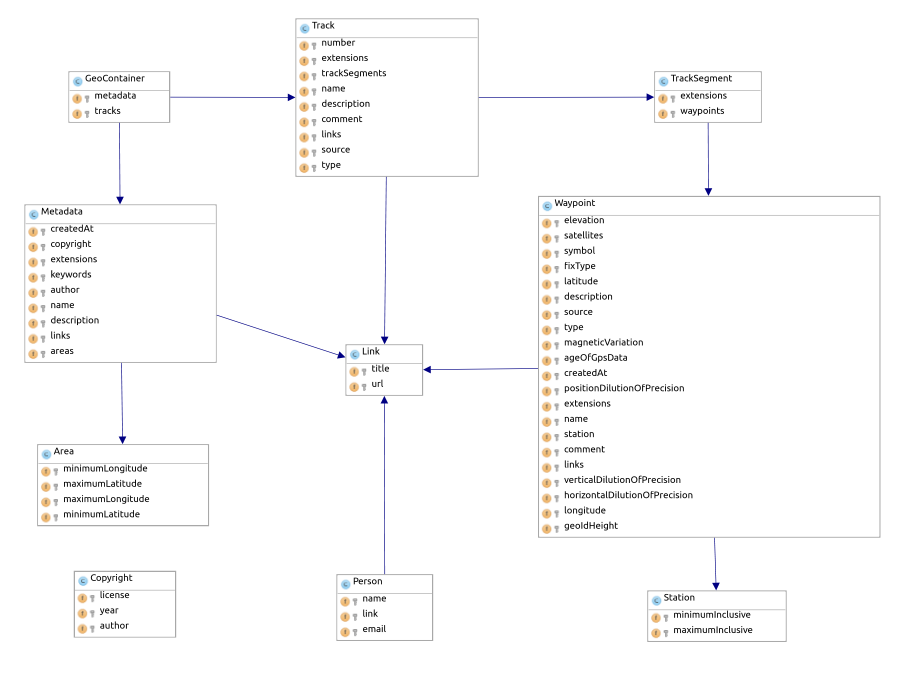

README
======

What is GeoParser PHP ?
-----------------------


GeoParser PHP is a simple library for read geo source files from different tracking devices and return an object model.

**Supported formats**

* GPX (http://www.topografix.com/gpx/1/1/) - Partial support

Example : http://www.topografix.com/GPX/1/1/gpx.xsd

**Planned**

* KML (https://developers.google.com/kml/documentation/)

UML
---



Try
---

```
bin/console geoparser:load src/GeoParser/Resources/fixtures/utgtrack-372.gpx gpx
```